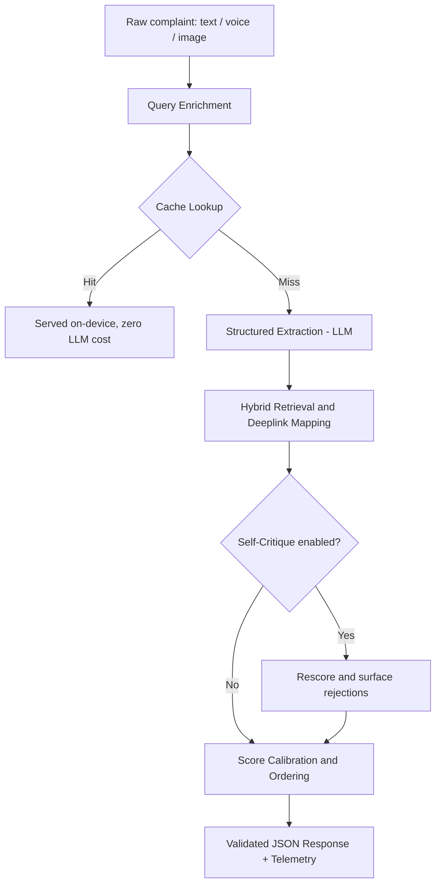

# Sentry

**Smart Guided Troubleshooting Engine, built for the Samsung PRISM GenAI Hackathon (Theme 2)**

A customer says "screen flickers and the battery dies fast." Today, turning that into an actual fix takes a support agent roughly 15 minutes of manual triage, and the customer still has to hunt through nested Settings menus by hand. Sentry collapses that into a single API call: it reads the complaint the way a person actually types it, works out what is really going on, and hands back a ranked, validated, one tap fix, deeplinked straight into the right settings screen.

The name is not decoration. Sentry stands guard at every layer of its own pipeline: it verifies its own retrieval before trusting it, it flags and discards its own hallucinated hypotheses out loud instead of hiding them, and it refuses to fabricate a fix for a complaint that was never a device issue in the first place.

This is not a chatbot wrapper around an LLM. It is a pipeline with real guardrails: deterministic safety rules that no prompt alone can be trusted to enforce, a semantic cache with a hard negation veto, a dual key failover system with a mathematically bounded latency guarantee, and a self critique pass that can catch and discard its own hallucinations before they ever reach the user.

---

## What it actually does

1. **Understands the complaint.** Enriches a vague, colloquial query into a clean technical intent, using both a Hinglish/vernacular tolerant enrichment step and a stronger LLM extraction pass underneath.
2. **Reasons about the root cause.** Extracts up to two ranked hypotheses per complaint, splits genuinely unrelated problems into separate diagnoses instead of blending them, and asks a targeted clarifying question when two candidates are too close to call.
3. **Grounds every answer in reality.** Matches each remediation step to a real, catalog verified Bixby deeplink using hybrid retrieval, never invents a URI, and strips web links on sight.
4. **Knows when it doesn't know.** If a complaint has nothing to do with a device, it says so, rather than fabricating a plausible sounding fix. This is enforced twice: once in the prompt, and once by a deterministic keyword backstop that cannot be talked out of it.
5. **Checks its own work.** An optional self critique pass rescoring each hypothesis against the original complaint, and any rejected candidate is surfaced to the user, not hidden.
6. **Stays fast under pressure.** A verified semantic cache serves repeat and paraphrased questions without touching the LLM at all. Every fallback path is bounded so a cold, worst case request still finishes well inside the spec's 8 second ceiling.
7. **Takes more than text.** Accepts a typed complaint, a spoken one, a photo of the problem, or a photo and a sentence together.

---

## Architecture



Every LLM call in the pipeline runs behind a dual key failover wrapper: if the primary key hits a quota wall, a backup key takes over inside the same request, invisibly. If both are exhausted, the system fails fast rather than retrying into a wall it cannot pass, and still returns a clean, honest response well within the latency budget.

---

## Why this holds up under scrutiny

Most of the interesting engineering here is not the happy path. It is what happens when things go wrong.

- **The semantic cache does not just check similarity, it checks meaning.** "Turn Bluetooth on" and "turn Bluetooth off" are nearly identical in embedding space and would be treated as the same query by a naive cache. This one runs a rule based polarity and entity veto specifically to catch that failure mode before serving a cached answer.
- **We ran the ablation the spec actually asks for**, comparing hybrid retrieval, a pure LLM baseline, and pure rules based matching, on the same query set. The baseline hallucinated non catalog URIs on multiple queries and violated the safety guard on critical actions. Hybrid retrieval hit 100 percent schema compliance and 100 percent deeplink accuracy on the same set. The full breakdown, including where each approach actually fails, is in `metrics.md`.
- **We found and fixed a real off domain hallucination bug live**, not in theory. A prompt only instruction was not enough on its own, so there is now a deterministic keyword backstop that cannot be argued out of it by the model.
- **The latency ceiling is proven, not assumed.** Every failure combination, self critique timing out, both keys exhausting quota, a transient upstream outage, was individually timed and confirmed to land under the 8 second cold path budget.

---

## Running it locally

```bash
git clone <this repo>
cd diagnos-ai
pip install -r requirements.txt
cp .env.example .env
# add your own Gemini API key to .env
cd backend
uvicorn main:app --reload
```

Then check `http://127.0.0.1:8000/health`. You should see `{"status": "ok"}`.

### Docker

```bash
docker build -t diagnos-ai .
docker run -p 8000:8000 --env-file .env diagnos-ai
```

---

## For judges

The fastest way to see everything working end to end in one shot:

```bash
python eval/smoke_test.py
```

This hits every major endpoint, all four device domains, the off domain refusal, both sides of the clarifying question flow, and the image pipeline, and prints a clear pass/fail summary with a final `SYSTEM STATUS` line.

For the full evaluation writeup, including the three way ablation, the confidence calibration analysis, and an honest accounting of where the system's own confidence score does and does not predict correctness, see `metrics.md`.

---

## Can it be taken further as a worklet?

Yes, and concretely, not just in principle. The path is short:

- **Swap the sample catalog for the real deeplink index.** The pipeline and evaluation harness already run against the sample data with zero code changes needed once the real catalog lands, since the retrieval layer was built against the same schema from the start.
- **Lean into the on-device angle.** A cache hit in this system never calls Gemini and never leaves the device. That is a genuine bandwidth and privacy win, not a marketing line, and it fits naturally into how Samsung already talks about on-device AI on Galaxy devices.
- **Harden retrieval against real-world phrasing.** A hackathon sample set is small by design. The real production win is retrieval that holds up against the much messier, larger scale phrasing actual users bring, which the current architecture is built to absorb without a redesign.

---

## Known limitations, stated plainly

- Built and benchmarked against a sample dataset while the official PRISM dataset was pending. The pipeline and evaluation harness are ready to run against the real catalog the moment it arrives, with no code changes required.
- Developed against the Gemini free tier, which has genuinely low per minute and per day request limits. The dual key failover exists specifically because of this constraint, and is a real, tested mitigation, not a theoretical one.
- The one action, one screen rule is enforced as a heuristic warning check, not a hard rejection, since detecting it reliably from text alone is a judgment call. False positive protection was tested explicitly against unusually phrased legitimate complaints.

---

## Built with

FastAPI, Pydantic, Google Gemini, BM25 and dense retrieval, fastembed for on device caching, and a genuinely stubborn amount of live testing.
